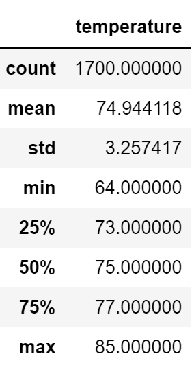
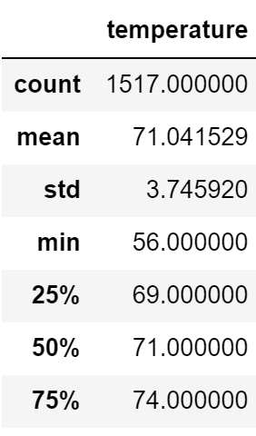

# Surfs Up Challenge
## Overview:
Potential investor W. Avy wants more information about temperature trends before opening a surf shop on Oahu. Specifically, he wants temperature data for the months of June and December in order to determine if the surf and ice cream shop business is sustainable year-round. The following analysis was conducted to give W. Avy a better picture of weather trends on Oahu.
## Results: 

*Figure 1. Descriptive statistics of June temperatures on Oahu.*

*Figure 2. Descriptive statistics of December temperatures on Oahu.*

* The average temperature in June on Oahu based on the data is 74.94 deg. F and the average temperature in December is 71.04 deg. F.
* The maximum temperature in June was 85 deg. F, the maximum temperature in December was 64 deg. 
* The minimum temperature in June was 85 deg. F, the minimum temperature in December was 56 deg F. 

## Summary: 
Based on the average and maximum temperature on Oahu in June and December, I believe the ice cream shop would be sustainable year round. The minimum temperature in June is 9 degrees warmer than the minimum temperature in December. This may be a cause of concern to the business because I believe that might be quite a bit colder than the ideal temperature for eating ice cream. However, I believe it would be more telling to run an analysis on precipitation levels in June and December. Having an understanding of both the temperature AND precipitation in June and December will give W. Avy the best understanding of how the ice cream shop will do year round. I've included the additional queries to run below.
Addition queries to run: 
* session.query(Measurement.date, Measurement.prcp).filter(func.strftime("%m", Measurement.date) == "06").all()

* session.query(Measurement.date, Measurement.prcp).filter(func.strftime("%m", Measurement.date) == "12").all()

